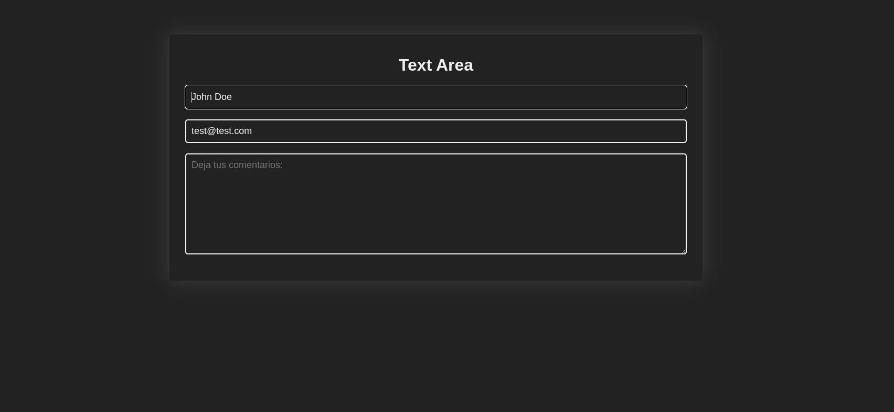

# Text Area Form - Proyecto Web

Este proyecto implementa un formulario elegante con área de texto, diseñado con un tema oscuro moderno que se adapta perfectamente a proyectos web.

## Características principales

- 🎨 Diseño oscuro con contraste elegante
- 📝 Campo de texto expandible (textarea)
- ✨ Efectos visuales modernos
- 📱 Diseño responsive
- 🔍 Campos con autocompletado desactivado
- 🎯 Campo de nombre con enfoque automático

## Uso

1. Clona el repositorio o descarga los archivos
2. Abre `index.html` en tu navegador
3. Completa los campos:
   - Nombre completo
   - Correo electrónico
   - Comentarios (en el área de texto expandible)

## Personalización

Puedes modificar fácilmente estos aspectos:


**Colores (en style.css):**
```css
body {
  background-color: #222; /* Color de fondo */
  color: #eee; /* Color de texto principal */
}

.form_control {
  box-shadow: 0 0 35px 0 #fff2; /* Sombra del formulario */
}

input, textarea {
  border: 2px solid #eee; /* Color del borde de los inputs */
}
```

**Tamaños:**
```css
.form_control {
  max-width: 50%; /* Ancho máximo del formulario */
  padding: 30px; /* Espaciado interno */
}

textarea {
  min-height: 20%; /* Altura mínima del textarea */
  max-height: 50%; /* Altura máxima del textarea */
}
```
