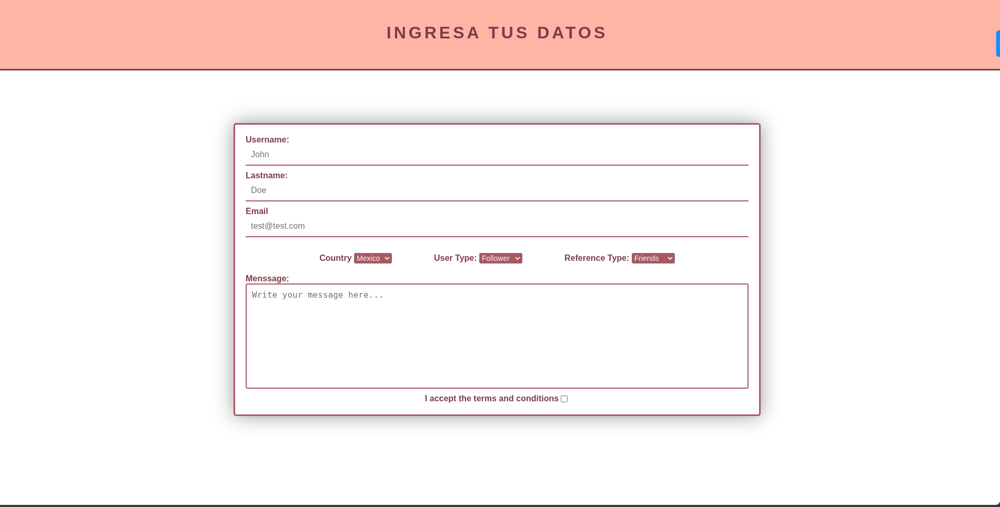

# Formulario de Registro con Menús Desplegables


Este proyecto implementa un formulario de registro completo con menús desplegables, área de texto y controles de formulario modernos, diseñado con una paleta de colores rosa suave y vino.

## Características principales

- 📋 Formulario completo con campos de texto, menús desplegables y área de mensajes
- 🌸 Diseño estético con colores rosa (#ffb5a5) y vino (#7c3c49)
- 🔘 Menús desplegables agrupados y centrados visualmente
- 📝 Área de texto con bordes personalizados
- ✅ Casilla de verificación para términos y condiciones
- ✨ Efectos visuales: sombras, bordes y gradientes sutiles
- 📱 Diseño responsive que se adapta a diferentes dispositivos
## Componentes del formulario

1. **Campos de texto:**
   - Nombre de usuario
   - Apellido
   - Correo electrónico

2. **Menús desplegables:**
   - País (México, USA, Brasil, Canadá, Francia)
   - Tipo de usuario (Follower, Company, Other)
   - Tipo de referencia (Friends, Publicity, Company, Other)

3. **Área de texto:**
   - Para mensajes/comentarios

4. **Casilla de verificación:**
   - Aceptación de términos y condiciones

## Uso

1. Clona el repositorio o descarga los archivos
2. Abre `index.html` en tu navegador web
3. Completa todos los campos del formulario
4. Haz clic en la casilla para aceptar términos y condiciones
5. Envía el formulario (la funcionalidad de envío puede implementarse posteriormente)

## Personalización

Puedes modificar fácilmente estos aspectos del diseño:

### Paleta de colores (en style.css)
```css
.title {
  background-color: #ffb5a5; /* Color de fondo del título */
  border-bottom: 3px solid #7c3c49; /* Borde inferior del título */
}

.container {
  border: 3px solid #ac5660; /* Borde del contenedor principal */
}

.form-control, .input-textarea {
  border-bottom: 2px solid #ac5660; /* Borde inferior de los inputs */
}

.dropdown-menu {
  background-color: #ac5660; /* Fondo de los menús desplegables */
  color: #eee; /* Color de texto de los menús */
}
```

## Tecnologías utilizadas

- HTML5 (Formularios, Selects, Textarea)
- CSS3 (Flexbox, Bordes, Sombras, Media Queries)
- Diseño responsivo

Este formulario es ideal para páginas de registro, sistemas de contacto, o cualquier aplicación web que requiera recopilar información detallada de los usuarios con una interfaz atractiva y fácil de usar.