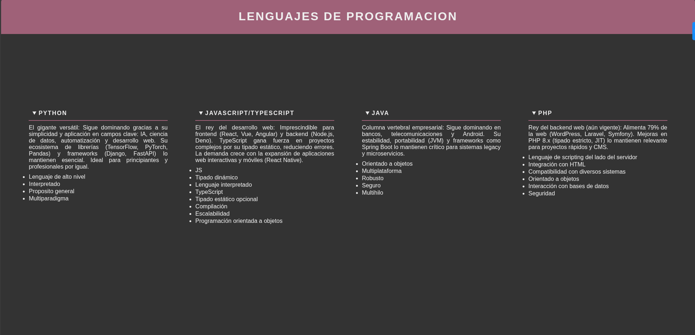

# Acordeón de Lenguajes de Programación

Este proyecto implementa un acordeón interactivo que muestra información sobre diferentes lenguajes de programación utilizando los elementos HTML semánticos `
` y `
`. Con un diseño oscuro elegante y distribución flexible, permite a los usuarios explorar características clave de cada lenguaje de forma organizada y accesible.

## Características principales

- 🎨 **Diseño oscuro elegante**: Paleta de colores en tonos morado (#9f6178) sobre fondo gris oscuro (#333)
- 📱 **Diseño responsive**: Distribución flexible que se adapta a diferentes tamaños de pantalla
- ✨ **Interactividad sin JavaScript**: Utiliza elementos HTML nativos `
` y `
`
- 📝 **Contenido estructurado**: Cada lenguaje incluye descripción y lista de características
- 🖥️ **Tipografía clara**: Fuente sans-serif con espaciado optimizado para mejor legibilidad

## Lenguajes incluidos

1. **Python** - El gigante versátil
2. **JavaScript/TypeScript** - El rey del desarrollo web
3. **Java** - Columna vertebral empresarial
4. **PHP** - Rey del backend web
## Uso

1. Clona el repositorio o descarga los archivos
2. Abre `index.html` en tu navegador web
3. Haz clic en el nombre de cualquier lenguaje para expandir su información
4. Explora las características y descripciones de cada lenguaje
## Tecnologías utilizadas

- HTML5 (Elementos semánticos: details, summary)
- CSS3 (Flexbox, Propiedades de texto)
- Diseño responsive

Este proyecto es ideal para desarrolladores que desean aprender sobre los elementos `
` y `
` de HTML, o para cualquier persona interesada en lenguajes de programación con un diseño minimalista y funcional.