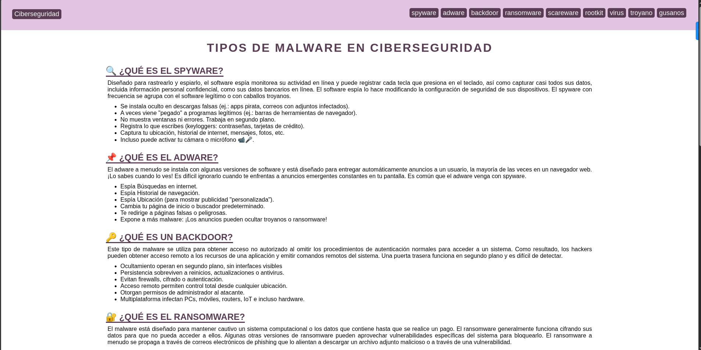

# Tipos de Malware en Ciberseguridad - Enlaces HTML

Este proyecto es una guía interactiva sobre los principales tipos de malware en ciberseguridad, implementada como una página web con navegación interna y diseño responsivo. Utiliza una paleta de colores morados y grises para presentar información técnica de manera accesible y estéticamente agradable.

## Características principales
- 🚀 **Navegación fluida**: Menú con enlaces internos a cada tipo de malware
- 🎨 **Diseño atractivo**: Paleta de colores morados (#593d54) sobre fondo claro
- 📱 **Responsive**: Se adapta a diferentes tamaños de pantalla
- 🧠 **Contenido educativo**: Información detallada sobre 9 tipos de malware
- ⚡ **Interacción**: Efectos hover en elementos de navegación
- 🧩 **Estructura clara**: Organización jerárquica de la información

## Tipos de malware cubiertos
1. 🔍 Spyware - Software espía
2. 📌 Adware - Malware publicitario
3. 🔑 Backdoor - Puertas traseras
4. 🔐 Ransomware - Software de secuestro
5. 🚨 Scareware - Malware de miedo
6. 👻 Rootkit - Malware oculto
7. 🦠 Virus - Malware autoreplicante
8. 🎭 Troyano - Malware disfrazado
9. 🐛 Gusanos - Malware de propagación rápida

## Uso
1. Clona el repositorio o descarga los archivos
2. Abre `index.html` en tu navegador web
3. Navega por las diferentes secciones usando el menú superior
4. Explora la información detallada sobre cada tipo de malware
## Tecnologías utilizadas
- HTML5 (Semántica, Enlaces internos)
- CSS3 (Flexbox, Propiedades de texto, Pseudoclases)
- Diseño responsivo

Este proyecto es ideal para educadores, estudiantes de ciberseguridad, o cualquier persona interesada en aprender sobre las diferentes amenazas de malware en un formato accesible y visualmente atractivo.