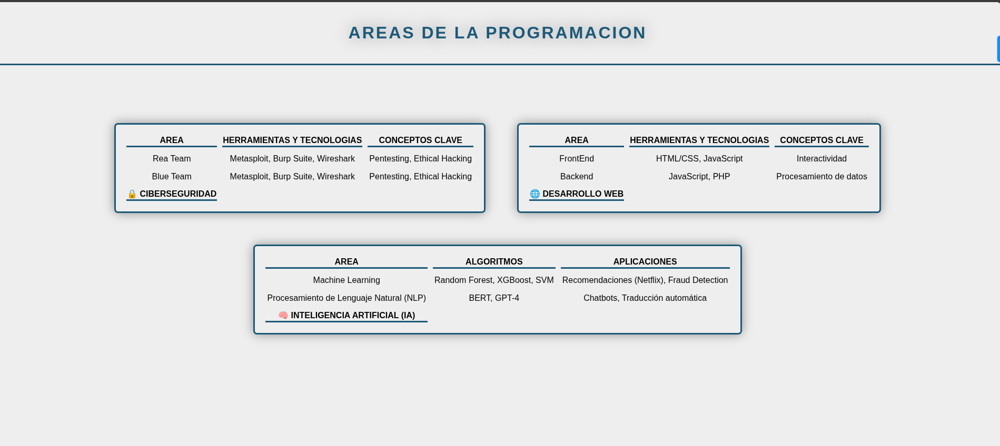

# Guía Visual de Áreas de Programación

Este proyecto presenta una comparación visual de diferentes áreas de programación utilizando tablas HTML con diseño moderno. Cada tabla muestra información clave sobre campos específicos como ciberseguridad, desarrollo web e inteligencia artificial, con una paleta de colores azul y gris que facilita la lectura y comprensión.

## Características principales
- 📊 **Tablas comparativas**: Organización clara de información técnica
- 🎨 **Diseño minimalista**: Paleta de colores azul (#1c5978) sobre fondo gris claro (#eee)
- 🧩 **Estructura modular**: Tablas independientes para cada área
- ✨ **Efectos visuales**: Sombras y bordes que mejoran la legibilidad
- 📱 **Diseño responsivo**: Adaptable a diferentes tamaños de pantalla

## Áreas cubiertas

1. **🔒 Ciberseguridad**:
   - Red Team
   - Blue Team

2. **🌐 Desarrollo Web**:
   - FrontEnd
   - Backend

3. **🧠 Inteligencia Artificial**:
   - Machine Learning
   - Procesamiento de Lenguaje Natural (NLP)
## Cómo usar
1. Clona el repositorio o descarga los archivos
2. Abre `index.html` en tu navegador web
3. Explora las diferentes áreas de programación
4. Compara herramientas, tecnologías y conceptos clave

## Tecnologías utilizadas
- HTML5 (Tablas semánticas: thead, tbody, tfoot)
- CSS3 (Flexbox, Sombras, Propiedades de texto)
- Diseño responsivo

Este proyecto es ideal para educadores, estudiantes de programación, o cualquier persona interesada en comprender las diferentes áreas del desarrollo de software de manera visual y organizada.