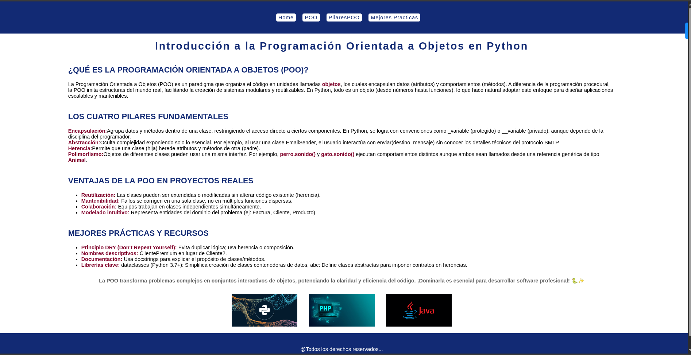

# Página Educativa sobre POO con Selectores CSS



Este proyecto es una página web educativa sobre Programación Orientada a Objetos (POO) en Python que demuestra el uso efectivo de diversos selectores CSS para crear una experiencia visual atractiva y bien estructurada.

## Características principales
- 🎓 **Contenido educativo**: Explicación clara de POO y sus pilares fundamentales
- 🎨 **Diseño profesional**: Paleta de colores azul (#122a74) y rojo vino (#83082f)
- 🧩 **Navegación intuitiva**: Menú superior con enlaces internos
- ✨ **Efectos interactivos**: Hover en enlaces e imágenes
- 📱 **Diseño responsivo**: Se adapta a diferentes dispositivos
- 🎯 **Demostración de selectores CSS**: Uso práctico de diversos selectores

## Selectores CSS implementados

1. **Selector universal (`*`)**:
```css
* {
  margin: 0;
  font-family: sans-serif;
  box-sizing: border-box;
}
```

2. **Selector de tipo (`element`)**:
```css
header {
  background-color: #122a74;
}
```

3. **Selector de clase (`.class`)**:
```css
.navbar {
  padding: 40px 10px;
}
```

4. **Selector descendiente (`.parent .child`)**:
```css
.main-container .main-title {
  color: #122a74;
}
```

5. **Selector de atributo (`[attribute]`)**:
```css
img[src$="png"] {
  width: 200px;
  height: 100px;
}
```

6. **Pseudoclase (`:hover`)**:
```css
.nav-link:hover {
  box-shadow: 0 0 30px 0 #fff9;
}
```

7. **Selector de hijo directo (`parent > child`)**:
```css
.sub-title > .text-content {
  text-align: justify;
}
```

## Uso
1. Clona el repositorio o descarga los archivos
2. Abre `index.html` en tu navegador web
3. Navega por las diferentes secciones usando el menú superior
4. Explora el contenido sobre Programación Orientada a Objetos
5. Inspecciona el código para ver los selectores CSS en acción

## Tecnologías utilizadas
- HTML5 (Semántica, Enlaces internos)
- CSS3 (Selectores avanzados, Flexbox, Transiciones)
- Diseño responsivo

Este proyecto es ideal para estudiantes que desean aprender sobre Programación Orientada a Objetos mientras exploran técnicas avanzadas de estilización con CSS, demostrando cómo los selectores pueden crear diseños atractivos y funcionales.