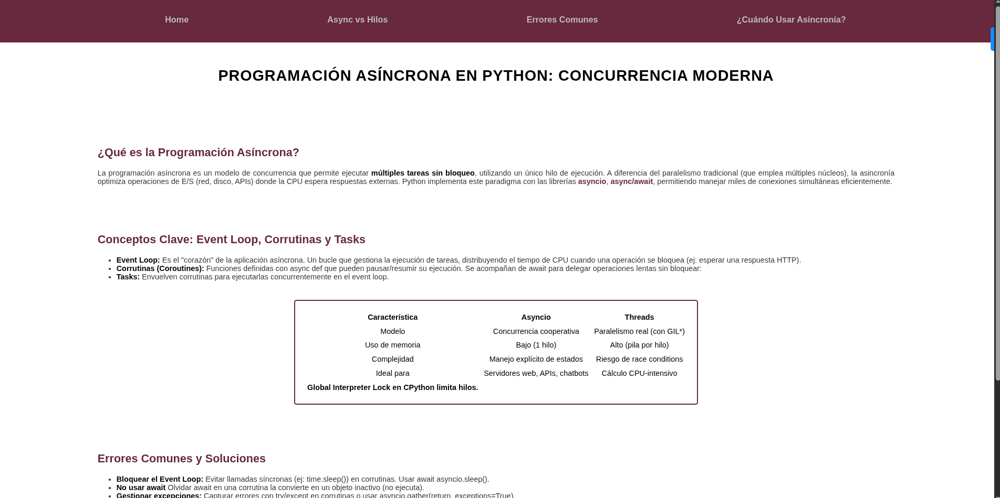

# Proyecto: Programación Asíncrona en Python con Metodología BEM



Este proyecto es una página educativa sobre programación asíncrona en Python que implementa la metodología BEM (Block, Element, Modifier) para la organización de clases CSS. El diseño muestra un uso práctico de BEM en un contexto real de desarrollo web.

## Características principales
- 🎓 **Contenido técnico**: Explicación clara de programación asíncrona, event loops y corrutinas
- 🧩 **Metodología BEM**: Implementación práctica de la convención de nomenclatura CSS
- 📊 **Tabla comparativa**: Diferencias entre asyncio y threads en Python
- 🎨 **Diseño profesional**: Paleta de colores vino (#68283d) sobre fondo claro
- ✨ **Efectos sutiles**: Hover states y sombras para mejorar la interactividad
- 📱 **Diseño responsivo**: Adaptable a diferentes dispositivos

## Estructura BEM implementada

### Bloques principales
- `.header` - Encabezado de la página
- `.navigation` - Menú de navegación
- `.main` - Contenido principal
- `.section` - Secciones de contenido
- `.table` - Tabla comparativa
- `.footer` - Pie de página

### Elementos (con doble guión bajo)
```css
.list__item       /* Elemento de lista */
.section__subtitle /* Subtítulo de sección */
.section__paragraph /* Párrafo de sección */
.table__header    /* Encabezado de tabla */
.table__row       /* Fila de tabla */
.table__head      /* Celda de encabezado */
.table__body      /* Cuerpo de tabla */
.table__description /* Celda de descripción */
.footer__text     /* Texto del pie de página */
```

### Modificadores (con doble guión medio)
```css
.subtitle--color  /* Subtítulo con color especial */
.item--selected   /* Ítem de lista seleccionado */
```

## Uso
1. Clona el repositorio o descarga los archivos
2. Abre `index.html` en tu navegador web
3. Explora el contenido sobre programación asíncrona
4. Inspecciona el código para ver la implementación de BEM
5. Navega entre secciones usando el menú superior

## Ventajas de usar BEM
1. **Modularidad**: Cada bloque es independiente y reusable
2. **Claridad en las relaciones**: Fácil identificar elementos y modificadores
3. **Evita conflictos**: Las clases son específicas y no chocan entre componentes
4. **Facilita el mantenimiento**: Cambios en un bloque no afectan otros componentes
## Tecnologías utilizadas
- HTML5 (Semántica, Estructura)
- CSS3 (BEM, Flexbox, Pseudoclases)
- Metodología BEM para organización de CSS
- Diseño responsivo

Este proyecto es ideal para desarrolladores que desean aprender sobre programación asíncrona en Python mientras implementan mejores prácticas de organización CSS con la metodología BEM, demostrando cómo crear código mantenible y escalable.