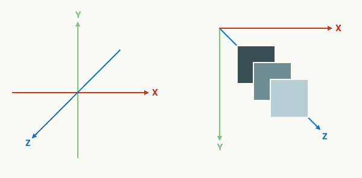
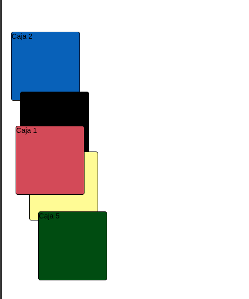

# Proyecto: Demostración de Position Relative en CSS




Este proyecto es una demostración visual del uso de `position: relative` en CSS, mostrando cómo esta propiedad permite desplazar elementos desde su posición original sin afectar el diseño del resto de la página.

## Características principales
- 🧱 **5 cajas de colores**: Cada una con un color diferente
- ⬆️ **Desplazamiento gradual**: Cada caja se mueve en relación a su posición original
- 🎨 **Efecto de superposición**: Las cajas se superponen para mostrar el concepto de capas
- 🔝 **Uso de z-index**: Demostración de cómo controlar el orden de apilamiento
- 📚 **Ejemplo educativo**: Visualización clara de cómo funciona position: relative

## Conceptos CSS demostrados

1. **Position: relative**:
```css
.box {
  position: relative;
}
```
- Permite desplazar un elemento desde su posición normal
- Mantiene el espacio original reservado en el documento

2. **Propiedades de desplazamiento**:
```css
.box--blue {
  top: -20px;
  left: 20px;
}
```
- `top`, `bottom`, `left`, `right` controlan el desplazamiento
- Los valores negativos mueven el elemento en dirección opuesta

3. **z-index**:
```css
.box:first-child {
  z-index: 10;
}
```
- Controla el orden de apilamiento de elementos superpuestos
- Valores más altos se colocan sobre valores más bajos
## Cómo funciona
Cada caja tiene una posición relativa y se desplaza gradualmente:

1. **Caja roja**: Posición original modificada con top y left
2. **Caja azul**: Desplazada 20px hacia arriba y 20px a la derecha
3. **Caja negra**: Desplazada 40px hacia arriba y 40px a la derecha
4. **Caja amarilla**: Desplazada 60px hacia arriba y 60px a la derecha
5. **Caja verde**: Desplazada 80px hacia arriba y 80px a la derecha

La primera caja (roja) tiene además un z-index más alto para demostrar el control de capas.
## Aprendizaje clave
- `position: relative` permite mover elementos desde su posición normal
- El espacio original del elemento permanece reservado en el documento
- Los desplazamientos son relativos a la posición original del elemento
- `z-index` controla el orden de apilamiento cuando los elementos se superponen
- Es ideal para pequeños ajustes de posición sin alterar el flujo del documento
## Tecnologías utilizadas
- HTML5 (Estructura básica)
- CSS3 (Position, Box Model, z-index)
- Concepto de posicionamiento relativo en CSS

Este proyecto es ideal para desarrolladores que están aprendiendo sobre posicionamiento en CSS y quieren comprender visualmente cómo funciona `position: relative` y cómo se diferencia de otros tipos de posicionamiento como `absolute` o `fixed`.