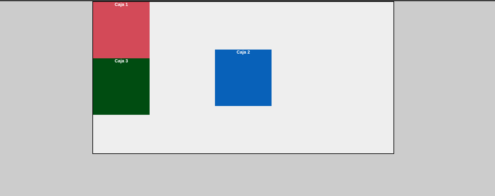

# Proyecto: Demostración de Position Absolute en CSS



Este proyecto demuestra el uso práctico de `position: absolute` en CSS, mostrando cómo posicionar elementos de manera precisa en relación con su contenedor padre. Es un ejemplo educativo que ilustra los conceptos fundamentales del posicionamiento absoluto en el diseño web.

## Características principales
- 🧩 **Contenedor relativo**: Elemento padre con `position: relative` que sirve como punto de referencia
- 🔵 **Caja absoluta**: Elemento centrado con `position: absolute` usando la técnica de márgenes automáticos
- 🎨 **Diseño visual claro**: Tres cajas de colores diferentes para mostrar relaciones de posicionamiento
- 📐 **Centrado perfecto**: Demostración de cómo centrar elementos horizontal y verticalmente
- 📚 **Propósito educativo**: Ejemplo práctico de los conceptos de posicionamiento en CSS
## Conceptos clave demostrados

### Position: relative
```css
.container {
  position: relative;
}
```
- Establece un contexto de posicionamiento para los elementos hijos absolutos
- Sirve como punto de referencia para los desplazamientos absolutos
- No cambia la posición del elemento en el flujo normal del documento

### Position: absolute
```css
.box--blue {
  position: absolute;
}
```
- Saca el elemento del flujo normal del documento
- Se posiciona en relación con el ancestro posicionado más cercano (con position: relative, absolute, fixed o sticky)
- Permite un posicionamiento preciso usando top, right, bottom, left

### Centrado con position absolute
```css
.box--blue {
  top: 0;
  left: 0;
  right: 0;
  bottom: 0;
  margin: auto;
}
```
- Técnica para centrar elementos tanto vertical como horizontalmente
- Funciona solo cuando se especifican los cuatro lados (top, right, bottom, left)
- Requiere que el elemento tenga dimensiones definidas (width/height)

## Aprendizaje clave
1. **Contexto de posicionamiento**: Los elementos con position: absolute se posicionan en relación con el primer ancestro que tenga un position diferente de static
2. **Centrado absoluto**: La combinación de los cuatro lados a 0 y margin: auto centra el elemento perfectamente
3. **Flujo del documento**: Los elementos absolutos no afectan el posicionamiento de otros elementos
4. **Superposición**: Los elementos absolutos pueden superponerse a otros contenidos
5. **Relación padre-hijo**: El posicionamiento absoluto depende de un padre con posición relativa para un control preciso
## Tecnologías utilizadas
- HTML5 (Estructura básica)
- CSS3 (Position properties, Box Model, Centering techniques)
- Conceptos fundamentales de diseño CSS

Este proyecto es ideal para desarrolladores que están aprendiendo sobre posicionamiento en CSS y quieren comprender visualmente cómo funciona `position: absolute` y cómo se diferencia de otros tipos de posicionamiento como `relative` o `fixed`.