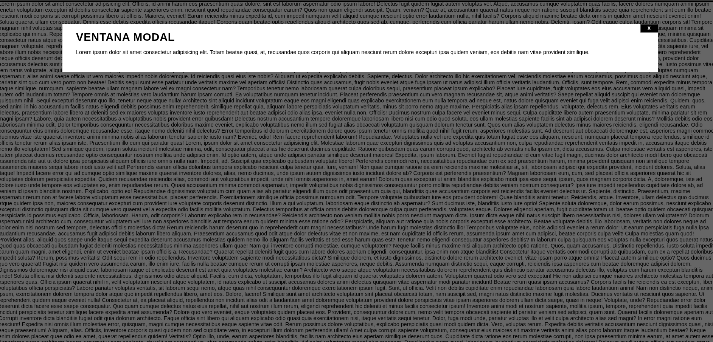

# Proyecto: Ventana Modal con HTML y CSS

Este proyecto implementa una ventana modal funcional utilizando el elemento nativo `<dialog>` de HTML5 con estilos personalizados en CSS. La modal se muestra sobre el contenido principal con un fondo oscurecido y contiene un título, contenido descriptivo y un botón de cierre.

## Características principales
- 🪟 **Modal nativa**: Uso del elemento `<dialog>` de HTML5
- 🎨 **Diseño limpio**: Fondo oscuro semi-transparente y contenido centrado
- ✨ **Botón de cierre**: Implementado con un botón en la esquina superior derecha
- 📱 **Responsive**: Se adapta a diferentes tamaños de pantalla
- 🖱️ **Interactividad**: Cierre de la modal al hacer clic en el botón "X"
- 🌓 **Fondo oscurecido**: Efecto de overlay que resalta el contenido modal
## Uso
1. Clona el repositorio o descarga los archivos
2. Abre `index.html` en tu navegador web
3. La ventana modal se mostrará automáticamente al cargar la página
4. Haz clic en el botón "X" para cerrar la modal
5. El contenido detrás de la modal está desplazado para demostrar el efecto de bloqueo

## Tecnologías utilizadas
- HTML5 (Elemento dialog)
- CSS3 (Estilos personalizados, posicionamiento, fondos)
- Diseño responsivo

Este proyecto es ideal para aprender sobre el elemento `<dialog>` y cómo crear componentes modales accesibles y estilizados sin necesidad de librerías externas. El código demuestra conceptos clave como posicionamiento, fondos superpuestos y diseño centrado.