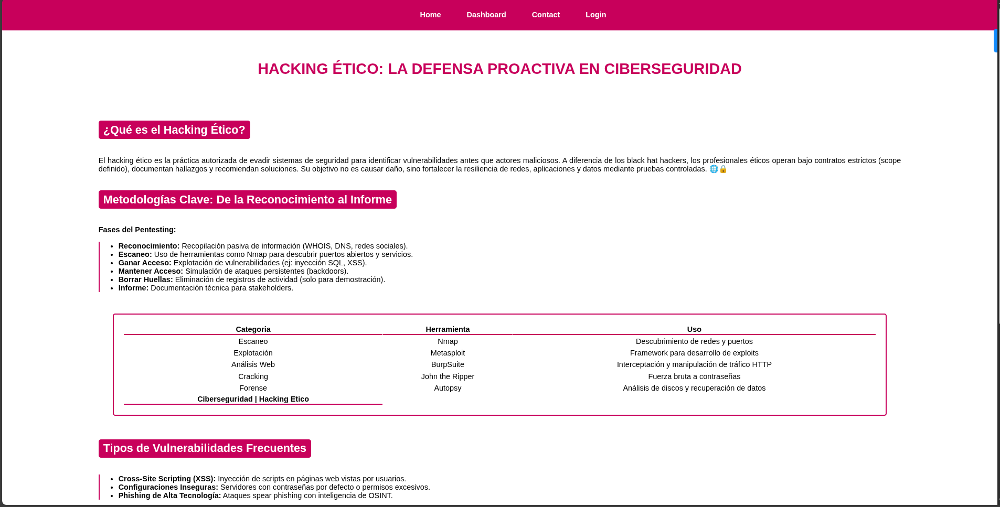

# Proyecto: Hacking Ético con Barra de Navegación Fija



Este proyecto implementa una página educativa sobre hacking ético que demuestra el uso práctico de `position: fixed` en CSS para crear una barra de navegación que permanece visible mientras se desplaza la página. La barra de navegación fija mejora la experiencia de usuario al proporcionar acceso constante a las secciones principales del contenido.

## Características principales
- 🧭 **Barra de navegación fija**: Implementada con `position: fixed` que permanece visible al desplazarse
- 🎓 **Contenido educativo**: Información detallada sobre hacking ético, metodologías y herramientas
- 📊 **Tabla comparativa**: Herramientas esenciales de ciberseguridad categorizadas
- 🎨 **Diseño profesional**: Paleta de colores rojo vino (#c8005b) sobre fondo claro
- 📱 **Diseño responsivo**: Adaptable a diferentes dispositivos
- ✨ **Efectos visuales**: Sombras y efectos hover para mejorar la interactividad

## Uso
1. Clona el repositorio o descarga los archivos
2. Abre `index.html` en tu navegador web
3. Desplázate por la página para ver cómo la barra de navegación permanece fija en la parte superior
4. Explora las diferentes secciones sobre hacking ético

## Concepto clave implementado: position: fixed

```css
.header {
  background-color: #c8005b;
  width: 100vw;
  position: fixed; /* Elemento clave */
  margin: 0;
}
```

### Características de position: fixed:
- **Posicionamiento relativo al viewport**: El elemento se posiciona en relación con la ventana gráfica del navegador
- **Siempre visible**: Permanece en el mismo lugar incluso al desplazar la página
- **Fuera del flujo normal**: No afecta la posición de otros elementos
- **Ideal para barras de navegación**: Proporciona acceso constante a la navegación principal

## Tecnologías utilizadas
- HTML5 (Semántica, Estructura)
- CSS3 (Position: fixed, Flexbox, Pseudoclases)
- Diseño responsivo

Este proyecto es ideal para estudiantes de ciberseguridad y desarrolladores web que desean aprender sobre hacking ético mientras implementan técnicas avanzadas de diseño CSS, demostrando cómo `position: fixed` puede mejorar la usabilidad de sitios web con contenido extenso.