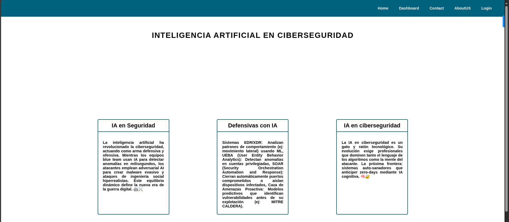

# Proyecto: Transiciones CSS en Ciberseguridad e IA



Este proyecto demuestra el uso práctico de transiciones CSS para crear efectos interactivos en una página web sobre Inteligencia Artificial en Ciberseguridad. Implementa diferentes tipos de transiciones en tarjetas de contenido para mejorar la experiencia del usuario.

## Características principales
- 🎓 **Contenido educativo**: Información sobre IA aplicada a ciberseguridad
- ✨ **Tres transiciones diferentes**: Cada tarjeta tiene un efecto único al pasar el mouse
- 🧩 **Barra de navegación fija**: Implementada con `position: fixed`
- 🎨 **Diseño cohesivo**: Paleta de colores azul profundo (#00627d)
- 📱 **Diseño responsivo**: Se adapta a diferentes tamaños de pantalla
- ⏱️ **Control de transiciones**: Duración, propiedad y función de temporización personalizadas

## Transiciones implementadas

### Tarjeta 1 - Cambio de color
```css
.card--one {
  transition-property: color;
  transition-duration: 1s;
}
.card--one:hover {
  color: #00627d;
}
```
- **Efecto**: Cambio suave del color del texto
- **Duración**: 1 segundo
- **Función de temporización**: Lineal (por defecto)

### Tarjeta 2 - Movimiento vertical
```css
.card--two {
  transition-property: bottom;
  transition-duration: 2s;
  transition-timing-function: ease;
  bottom: 0;
}
.card--two:hover {
  bottom: 200px;
}
```
- **Efecto**: La tarjeta se desplaza hacia arriba
- **Duración**: 2 segundos
- **Función de temporización**: `ease` (inicio y fin lentos)

### Tarjeta 3 - Movimiento con curva Bezier
```css
.card--three {
  transition-property: top;
  transition-duration: 1s;
  transition-timing-function: cubic-bezier(.12,.95,.96,.68);
  top: 0;
}
.card--three:hover {
  top: 100px;
}
```
- **Efecto**: La tarjeta se desplaza hacia abajo
- **Duración**: 1 segundo
- **Función de temporización**: Curva Bezier personalizada

## Uso
1. Clona el repositorio o descarga los archivos
2. Abre `index.html` en tu navegador web
3. Pasa el cursor sobre las tarjetas para activar las transiciones
4. Observa los diferentes efectos y tiempos de cada transición

## Tecnologías utilizadas
- HTML5 (Estructura semántica)
- CSS3 (Transiciones, Transformaciones, Cubic Bezier)
- Diseño responsivo
- Conceptos de experiencia de usuario (UX)

Este proyecto es ideal para desarrolladores que quieren aprender a crear efectos interactivos suaves con CSS, demostrando cómo las transiciones pueden mejorar significativamente la experiencia del usuario sin necesidad de JavaScript.