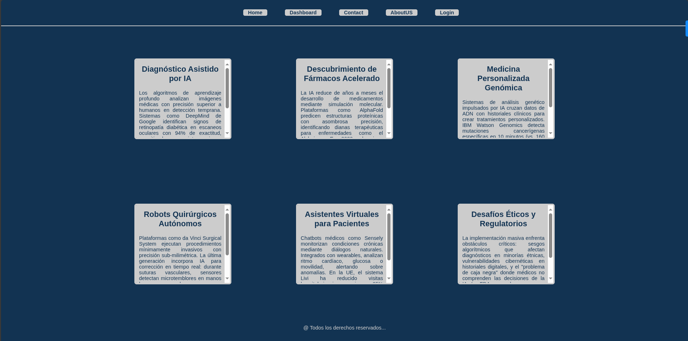

# Proyecto: Demostración de Overflow CSS



Este proyecto implementa una página web sobre aplicaciones de Inteligencia Artificial en medicina, demostrando el uso práctico de la propiedad CSS `overflow` para manejar contenido que excede el tamaño de sus contenedores. Combina diseño moderno con funcionalidad para crear una experiencia de usuario fluida.

## Características principales
- 📚 **Gestión de contenido extenso**: Uso de `overflow: auto` para crear áreas desplazables
- 🎨 **Diseño de tarjetas interactivas**: Efectos hover con transiciones suaves
- 🧩 **Doble contenedor flexible**: Organización de tarjetas en filas responsivas
- 💻 **Paleta de colores profesional**: Azul profundo (#123352) con acentos grises
- ✨ **Efectos visuales**: Sombras, bordes y transiciones para mejorar la experiencia
- 📱 **Diseño responsivo**: Se adapta a diferentes tamaños de pantalla
## Uso
1. Clona el repositorio o descarga los archivos
2. Abre `index.html` en tu navegador web
3. Explora las diferentes tarjetas de contenido
4. Pasa el cursor sobre las tarjetas para ver los efectos interactivos
5. Desplázate dentro de las tarjetas que contienen texto extenso

## Concepto clave: Overflow CSS
El proyecto demuestra el uso de `overflow: auto` en las tarjetas de contenido:

```css
.container__card {
  overflow: auto;
}
```

### Comportamiento:
- **Contenido dentro del contenedor**: El texto se muestra normalmente si cabe en el espacio asignado
- **Contenido excedente**: Aparecen barras de desplazamiento automáticamente cuando el contenido supera la altura del contenedor
- **Desplazamiento suave**: Los usuarios pueden desplazarse para ver el contenido completo sin afectar el diseño de la página

## Aprendizaje sobre overflow
La propiedad CSS `overflow` controla cómo se maneja el contenido que es demasiado grande para caber en un elemento. Los valores principales son:

1. **visible**: El contenido desborda el contenedor (valor por defecto)
2. **hidden**: El contenido excedente se oculta
3. **scroll**: Siempre muestra barras de desplazamiento
4. **auto**: Muestra barras de desplazamiento solo cuando son necesarias

## Tecnologías utilizadas
- HTML5 (Estructura semántica)
- CSS3 (Overflow, Flexbox, Transiciones, Pseudoclases)
- Principios de experiencia de usuario (UX)

Este proyecto es ideal para desarrolladores que están aprendiendo a manejar contenido extenso en interfaces web, demostrando cómo la propiedad `overflow` puede mejorar significativamente la presentación de información sin comprometer el diseño.