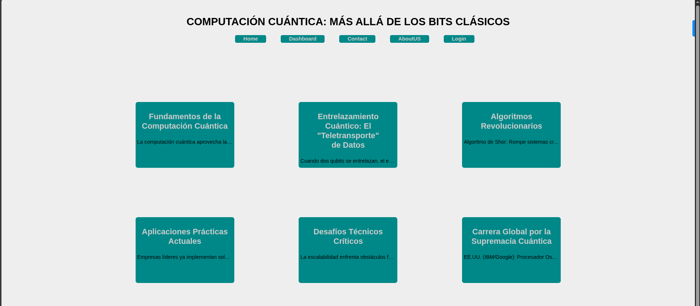

# Proyecto: Control de Flujo de Texto en CSS



Este proyecto demuestra técnicas avanzadas de control de flujo de texto en CSS, aplicadas a una página web sobre computación cuántica. Implementa diversas propiedades CSS para gestionar cómo se muestra el texto en diferentes contenedores, optimizando la legibilidad y el diseño visual.

## Características principales
- 📚 **Técnicas de control de texto**: Implementación de `text-wrap`, `white-space`, `text-overflow` y `overflow`
- 🎓 **Contenido educativo**: Información sobre fundamentos de computación cuántica
- 🧩 **Diseño modular**: Tarjetas organizadas en contenedores flexibles
- 🎨 **Paleta de colores profesional**: Azul turquesa (#088) sobre fondo oscuro
- ✨ **Efectos visuales**: Diseño limpio con bordes redondeados
- 📱 **Diseño responsivo**: Se adapta a diferentes tamaños de pantalla

## Propiedades de control de texto implementadas

### 1. `text-wrap: pretty`
```css
.container__subtitle {
  text-wrap: pretty;
}
```
- Mejora el ajuste de texto en títulos
- Evita palabras solitarias en la última línea
- Crea un diseño más equilibrado para los encabezados

### 2. `white-space: nowrap`
```css
.container__text {
  white-space: nowrap;
}
```
- Mantiene el texto en una sola línea
- Previene saltos de línea automáticos
- Ideal para textos cortos que deben mantenerse en una línea

### 3. `text-overflow: ellipsis`
```css
.container__text {
  text-overflow: ellipsis;
}
```
- Añade puntos suspensivos (...) cuando el texto es demasiado largo
- Indica visualmente que hay contenido adicional
- Mejora la estética al evitar cortes abruptos

### 4. `overflow: hidden`
```css
.container__text {
  overflow: hidden;
}
```
- Oculta el contenido que excede el contenedor
- Mantiene el diseño limpio y controlado
- Funciona en conjunto con text-overflow: ellipsis

## Uso
1. Clona el repositorio o descarga los archivos
2. Abre `index.html` en tu navegador web
3. Explora las diferentes tarjetas de contenido
4. Observa cómo se aplican las técnicas de control de texto:
   - Títulos con `text-wrap: pretty`
   - Contenido con `white-space: nowrap`
   - Texto truncado con `text-overflow: ellipsis`
   - Contenido oculto con `overflow: hidden`
## Tecnologías utilizadas
- HTML5 (Estructura semántica)
- CSS3 (Propiedades de control de texto, Flexbox, Diseño responsivo)
- Técnicas avanzadas de tipografía web

Este proyecto es ideal para desarrolladores que quieren aprender a controlar cómo se muestra el texto en diferentes contextos, demostrando técnicas prácticas para mejorar la legibilidad y estética de los contenidos en la web.