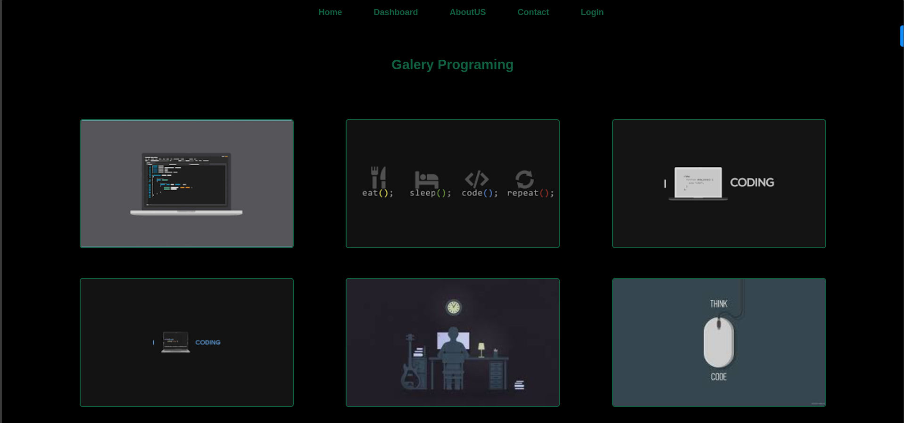

# Galería de Imágenes con Object Fit y Position



Este proyecto implementa una galería de imágenes moderna que demuestra el uso efectivo de `object-fit` y posicionamiento en CSS para crear una experiencia visual atractiva y responsive. La galería muestra imágenes de programación con efectos interactivos y un diseño elegante.

## Características principales
- 🖼️ **Uso de object-fit: cover**: Mantiene la relación de aspecto de las imágenes mientras llena el contenedor
- ✨ **Efectos hover interactivos**: Las imágenes se elevan suavemente al pasar el cursor
- 🎨 **Diseño minimalista**: Paleta de colores negro con acentos verdes (#126042)
- 🧩 **Diseño flexible**: Galería organizada con Flexbox
- ⏱️ **Transiciones suaves**: Animaciones con función de temporización personalizada
## Uso
1. Clona el repositorio o descarga los archivos
2. Abre `index.html` en tu navegador web
3. Pasa el cursor sobre las imágenes para ver el efecto de elevación
4. Explora la navegación superior con sus efectos hover

## Conceptos clave implementados

### Object-fit: cover
```css
.container__img {
  object-fit: cover;
}
```
- Mantiene la relación de aspecto de las imágenes
- Asegura que las imágenes llenen completamente sus contenedores
- Recorta las imágenes cuando es necesario para mantener la proporción
- Alternativas: `contain`, `fill`, `none`, `scale-down`

### Posicionamiento relativo para efectos hover
```css
.container__img {
  position: relative;
  bottom: 0;
  transition: bottom 1s cubic-bezier(.12,.95,.96,.68);
}

.container__img:hover {
  bottom: 30px;
}
```
- Cambio suave de posición al pasar el cursor
- Función de temporización personalizada con cubic-bezier
- Mantiene el flujo del documento mientras crea efecto visual

### Flexbox para diseño de galería
```css
.container {
  display: flex;
  justify-content: space-evenly;
  align-items: center;
}
```
- Distribución uniforme de las imágenes
- Alineación centrada verticalmente
- Diseño responsivo y flexible

## Tecnologías utilizadas
- HTML5 (Estructura semántica)
- CSS3 (Object-fit, Flexbox, Transiciones, Posicionamiento)

Este proyecto es ideal para desarrolladores que quieren aprender a crear galerías de imágenes modernas y responsivas, demostrando cómo `object-fit` y el posicionamiento CSS pueden mejorar significativamente la presentación visual de contenido multimedia.