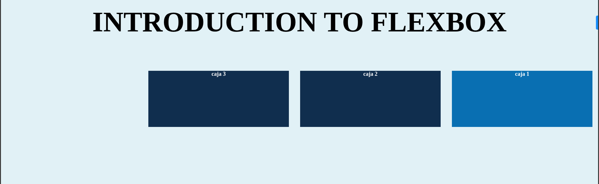

# Introducción a Flexbox: `display: flex` y `flex-direction`

Este proyecto es un ejemplo práctico que demuestra los conceptos básicos de Flexbox, específicamente las propiedades `display: flex` y `flex-direction`.

## Características del proyecto
- Implementa un contenedor Flexbox con tres elementos hijos
- Muestra el uso de `flex-direction: row-reverse`
- Incluye estilos básicos para visualizar el comportamiento de Flexbox
- Demuestra cómo modificar elementos individuales dentro de un contenedor Flex

## Conceptos de Flexbox demostrados

### 1. `display: flex`
```css
.container {
    display: flex;
}
```
Esta propiedad convierte un elemento en un **contenedor flex** y sus hijos directos en **elementos flex**. Esto permite controlar la distribución y alineación de los elementos hijos.

### 2. `flex-direction`
```css
.container {
    flex-direction: row-reverse;
}
```
Esta propiedad define la dirección principal en la que se colocarán los elementos flex. Los valores posibles son:

- `row` (valor por defecto): Izquierda a derecha
- `row-reverse`: Derecha a izquierda
- `column`: Arriba hacia abajo
- `column-reverse`: Abajo hacia arriba

En este ejemplo usamos `row-reverse`, lo que hace que los elementos aparezcan en orden inverso (de derecha a izquierda).
### Comportamiento resultante
1. Los elementos se ordenan de derecha a izquierda debido a `row-reverse`
2. La primera caja en el código HTML aparece visualmente como la última
3. Todas las cajas mantienen su tamaño original gracias a que no usamos `flex` en los items
4. La primera caja (en el orden HTML) tiene un color diferente

## Cómo ejecutar el proyecto
1. Clona este repositorio o descarga los archivos
2. Abre el archivo `index.html` en tu navegador web
3. Observa cómo las cajas están ordenadas de derecha a izquierda

## Recursos adicionales
- [Guía completa de Flexbox](https://css-tricks.com/snippets/css/a-guide-to-flexbox/)
- [Juego para aprender Flexbox](https://flexboxfroggy.com/)
- [Documentación MDN sobre Flexbox](https://developer.mozilla.org/es/docs/Web/CSS/CSS_Flexible_Box_Layout/Basic_Concepts_of_Flexbox)

Este ejemplo muestra los fundamentos de Flexbox. ¡Experimenta con diferentes valores para dominar esta poderosa técnica de diseño CSS!