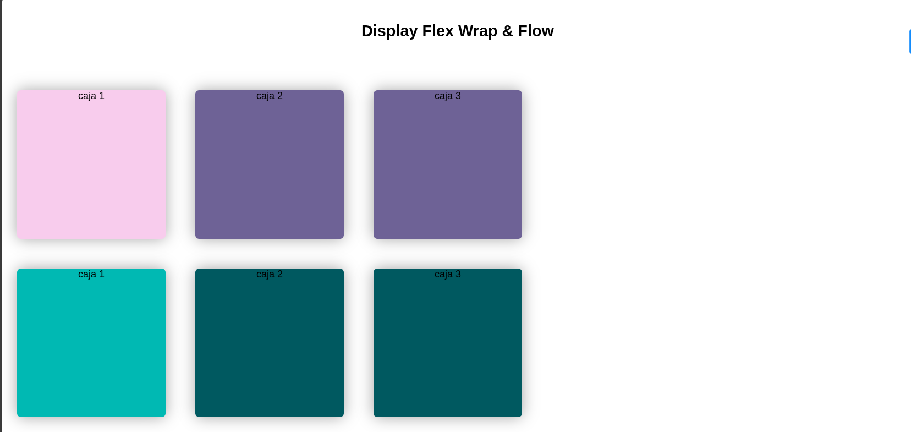

# Flexbox: Propiedades `flex-wrap` y `flex-flow`

Este proyecto demuestra el uso de dos propiedades avanzadas de Flexbox: `flex-wrap` y `flex-flow`. Estas propiedades permiten controlar cómo se comportan los elementos flexibles cuando no caben en una sola línea dentro de su contenedor.

## Características principales
- Dos contenedores Flexbox con comportamientos diferentes
- Uso de `flex-wrap: wrap-reverse` en el primer contenedor
- Uso de `flex-flow: row wrap` en el segundo contenedor
- Efectos de hover en los elementos flex
- Diseño responsivo que se adapta a diferentes tamaños de pantalla

## Conceptos de Flexbox demostrados

### 1. `flex-wrap`
```css
.container__one {
    flex-wrap: wrap-reverse;
}
```
Esta propiedad controla si los elementos flexibles deben ajustarse en varias líneas cuando no caben en una sola línea:

- `nowrap` (valor predeterminado): Todos los elementos en una sola línea
- `wrap`: Elementos se ajustan en múltiples líneas (de arriba hacia abajo)
- `wrap-reverse`: Elementos se ajustan en múltiples líneas (de abajo hacia arriba)

### 2. `flex-flow`
```css
.container__two {
    flex-flow: row wrap;
}
```
Esta propiedad es una abreviatura para establecer `flex-direction` y `flex-wrap` en una sola declaración:

```css
flex-flow: <flex-direction> <flex-wrap>;
```
## Comportamiento esperado

1. **Contenedor Uno**:
   - Los elementos se ajustan en múltiples líneas cuando el ancho del contenedor es insuficiente
   - El orden de las líneas es inverso (la primera línea aparece en la parte inferior)
   - El primer elemento tiene un color diferente

2. **Contenedor Dos**:
   - Los elementos se ajustan en múltiples líneas de forma normal
   - El primer elemento tiene un color diferente
   - Mismo efecto de hover que el primer contenedor

## Cómo ejecutar el proyecto
1. Descarga los archivos HTML y CSS
2. Abre el archivo HTML en tu navegador
3. Redimensiona la ventana del navegador para ver cómo se comportan los elementos flex al cambiar el tamaño
## Recursos adicionales
- [Guía completa de flex-wrap en MDN](https://developer.mozilla.org/es/docs/Web/CSS/flex-wrap)
- [Documentación de flex-flow en CSS-Tricks](https://css-tricks.com/almanac/properties/f/flex-flow/)
- [Juego interactivo para aprender Flexbox](https://flexboxfroggy.com/)
- [Visualizador de funciones de tiempo cúbicas](https://cubic-bezier.com/)

Este proyecto te ayuda a entender cómo controlar el flujo de elementos en contenedores flex cuando el espacio es limitado, una habilidad esencial para crear diseños responsivos.