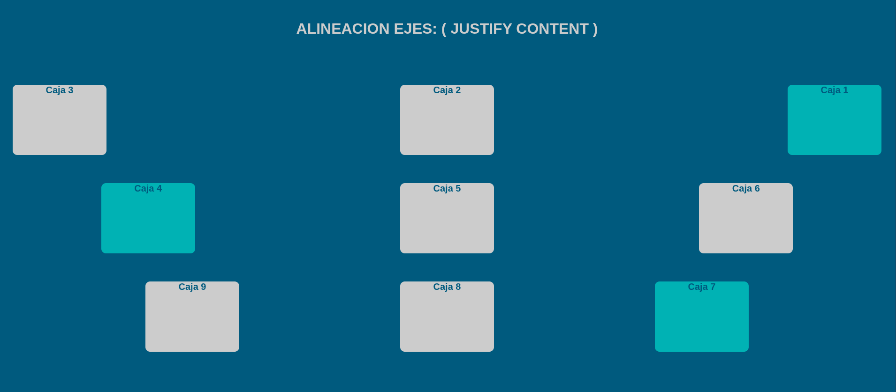

# Flexbox: Alineación con `justify-content`

Este proyecto demuestra el uso de la propiedad `justify-content` en Flexbox, que controla la alineación de los elementos flexibles a lo largo del **eje principal** del contenedor.

## Características principales
- Tres contenedores Flexbox con diferentes configuraciones de `justify-content`
- Uso combinado con `flex-flow` para dirección y ajuste
- Estilos visuales para diferenciar cada tipo de alineación
- Diseño responsivo que se adapta a diferentes tamaños de pantalla

## Conceptos de Flexbox demostrados

### Propiedad `justify-content`
Controla cómo se distribuye el espacio entre y alrededor de los elementos flexibles a lo largo del eje principal:

1. **`space-between`** (Contenedor 1):
   - Los elementos se distribuyen uniformemente
   - El primer elemento al inicio, el último al final
   - Espacio igual entre elementos

2. **`space-around`** (Contenedor 2):
   - Los elementos se distribuyen con espacio igual alrededor
   - Cada elemento tiene medio espacio en sus extremos

3. **`space-evenly`** (Contenedor 3):
   - Los elementos se distribuyen con espacio igual entre ellos y con los bordes
   - Todos los espacios son iguales
#### Contenedor 1: `space-between`
```css
.container__one {
    display: flex;
    flex-flow: row-reverse wrap;
    justify-content: space-between;
}
```
- Dirección inversa (`row-reverse`)
- Ajuste en múltiples líneas (`wrap`)
- Máximo espacio entre elementos

#### Contenedor 2: `space-around`
```css
.container__two {
    display: flex;
    flex-flow: row wrap;
    justify-content: space-around;
}
```
- Dirección normal (`row`)
- Espacio igual alrededor de cada elemento

#### Contenedor 3: `space-evenly`
```css
.container__three {
    display: flex;
    flex-flow: row-reverse wrap-reverse;
    justify-content: space-evenly;
}
```
- Dirección y ajuste inversos
- Espacios completamente uniformes

## Visualización del comportamiento

1. **Contenedor 1 (`space-between`)**:
   - Elementos pegados a los extremos
   - Espacio uniforme entre ellos
   - Orden inverso (por `row-reverse`)

2. **Contenedor 2 (`space-around`)**:
   - Espacio alrededor de cada elemento
   - El espacio entre elementos es el doble que el espacio en los extremos

3. **Contenedor 3 (`space-evenly`)**:
   - Espacio exactamente igual en todos los lugares
   - Orden y dirección inversos

## Cómo ejecutar el proyecto
1. Descarga los archivos HTML y CSS
2. Abre el archivo HTML en tu navegador
3. Observa las diferencias en la distribución de los elementos
4. Redimensiona la ventana para ver el comportamiento responsivo
## Recursos adicionales
- [Guía completa de justify-content en MDN](https://developer.mozilla.org/es/docs/Web/CSS/justify-content)
- [Visualizador interactivo de Flexbox](https://yoksel.github.io/flex-cheatsheet/)
- [Juego para practicar justify-content](https://flexboxfroggy.com/)
- [Diferencias entre space-around, space-between y space-evenly](https://css-tricks.com/almanac/properties/j/justify-content/)

Este proyecto te ayuda a dominar una de las propiedades más útiles de Flexbox para crear diseños bien espaciados y alineados. ¡Experimenta con diferentes combinaciones para ver todos los posibles resultados!