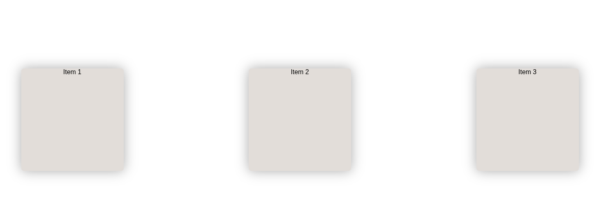

# Flexbox: Alineación con `align-items`

Este proyecto demuestra el uso de la propiedad `align-items` en Flexbox, que controla la alineación de los elementos flexibles a lo largo del **eje transversal** (cross axis) del contenedor.

## Concepto clave: `align-items`

La propiedad `align-items` define cómo se distribuyen los elementos a lo largo del eje perpendicular al eje principal:
```css
body {
    display: flex;
    align-items: center;
}
```

## Valores principales de `align-items`
1. **`center`** (usado en este proyecto):
   - Centra los elementos verticalmente (si el flujo es horizontal)
   - Alinea al centro del contenedor

2. **`flex-start`**:
   - Alinea los elementos al inicio del eje transversal

3. **`flex-end`**:
   - Alinea los elementos al final del eje transversal

4. **`stretch`** (valor por defecto):
   - Estira los elementos para llenar el contenedor

5. **`baseline`**:
   - Alinea los elementos según su línea base de texto

## Análisis del código actual

### Configuración Flexbox del contenedor (body)
```css
body {
    display: flex;
    flex-flow: row wrap-reverse;
    justify-content: space-evenly;
    align-items: center;
    height: 100vh; /* Importante para ver el efecto vertical */
}
```
- `flex-flow: row wrap-reverse`: dirección horizontal con ajuste inverso
- `justify-content: space-evenly`: distribución en el eje principal
- `align-items: center`: centrado en el eje transversal

### Estilos de los items
```css
.container__items {
    width: 250px;
    height: 250px;
    margin: 30px;
    /* Efecto hover interesante */
    transition-timing-function: cubic-bezier(.1,.91,.96,.71);
    transition-property: bottom;
    transition-duration: 2s;
}
```
- Todos los items tienen altura fija
- Efecto de elevación al hacer hover con transición personalizada

## Visualización del comportamiento
1. Todos los elementos están centrados verticalmente en el viewport
2. Se distribuyen horizontalmente con espacio uniforme (`space-evenly`)
3. El orden de las líneas es inverso (`wrap-reverse`)
4. Efecto visual al pasar el mouse sobre cualquier item

## Recursos adicionales
1. [Guía completa de align-items en MDN](https://developer.mozilla.org/es/docs/Web/CSS/align-items)
2. [Diferencia entre align-items y align-content](https://css-tricks.com/almanac/properties/a/align-content/)
3. [Visualizador interactivo de Flexbox](https://yoksel.github.io/flex-cheatsheet/)
4. [Juego para practicar alineaciones](https://flexboxfroggy.com/)

Este proyecto te ayuda a entender cómo controlar la alineación vertical (o transversal) en diseños Flexbox, complementando perfectamente lo que ya sabes sobre `justify-content` para el eje principal.