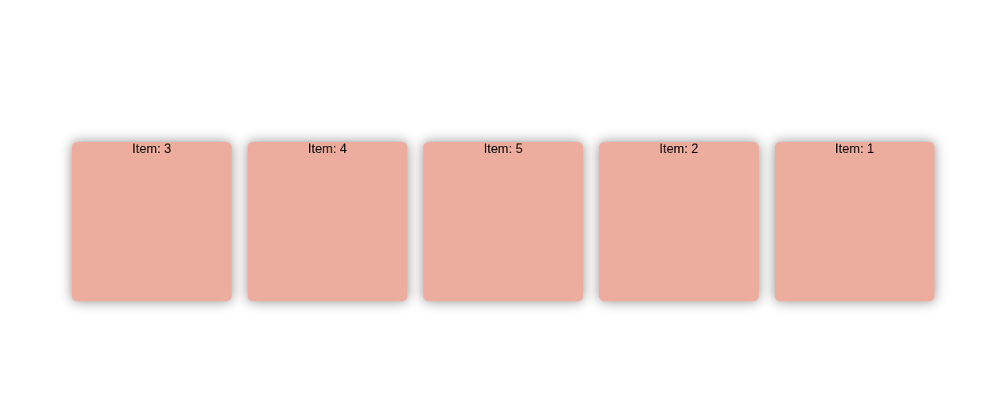

# Flexbox: Control de orden con la propiedad `order`

Este proyecto demuestra cómo usar la propiedad `order` en Flexbox para controlar el orden de visualización de los elementos flexibles, independientemente de su orden en el HTML.

## Concepto clave: `order`

La propiedad `order` permite reordenar elementos flexibles sin modificar el código HTML:
```css
.item {
    order: <número-entero>;
}
```

### Características principales:
- Valor por defecto: `0` para todos los elementos
- Los elementos con valores más bajos aparecen primero
- Puede usarse valores negativos
- No afecta el orden del DOM, solo el visual

## Análisis del código actual

### HTML básico
```html
<div class="box__items item--one">Item: 1</div>
<div class="box__items item--two">Item: 2</div>
...
```

### CSS con propiedades order
```css
.item--two {
    order: 10;  /* Aparecerá después que los elementos sin order definido */
}

.item--one {
    order: 20;  /* Aparecerá al final */
}
```

### Comportamiento resultante:
1. Items 3, 4 y 5 mantienen `order: 0` (implícito)
2. Item 2 tiene `order: 10` (aparece después de los de orden 0)
3. Item 1 tiene `order: 20` (aparece último)

## Orden de visualización esperado:
1. Item 3 (order: 0)
2. Item 4 (order: 0)
3. Item 5 (order: 0)
4. Item 2 (order: 10)
5. Item 1 (order: 20)
## Limitaciones importantes

1. **Accesibilidad**:
   - El orden visual no cambia el orden del DOM
   - Los lectores de pantalla siguen el orden HTML

2. **No usar para contenido importante**:
   - No es adecuado para reordenar contenido que afecte el significado

3. **Soporte en navegadores antiguos**:
   - Funciona en todos los navegadores modernos
   - IE10/11 tienen implementación parcial

## Recursos adicionales
1. [Documentación MDN sobre order](https://developer.mozilla.org/es/docs/Web/CSS/order)
2. [Guía visual de la propiedad order](https://css-tricks.com/almanac/properties/o/order/)
3. [Ejemplos prácticos de uso](https://flexboxfroggy.com/) (niveles 19-24)

Este proyecto te ha mostrado cómo controlar el orden de visualización en Flexbox, una herramienta poderosa para crear diseños flexibles sin modificar la estructura HTML subyacente.