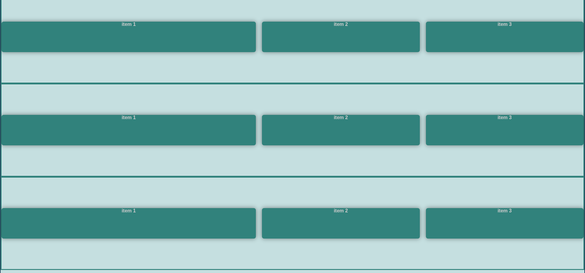

# Flexbox: Control de elementos hijos con `flex-grow`, `flex-shrink` y `flex-basis`

Este proyecto demuestra las propiedades fundamentales para controlar el comportamiento de los elementos hijos en un contenedor Flexbox.


## Propiedades clave aprendidas

### 1. `flex-grow`
Controla cómo crece un elemento cuando hay espacio disponible:
- Valor por defecto: `0` (no crece)
- En el proyecto: el primer hijo tiene `flex-grow: 2` (crece el doble que los demás)

### 2. `flex-shrink`
Controla cómo se reduce un elemento cuando no hay suficiente espacio:
- Valor por defecto: `1`
- En el proyecto: el último hijo tiene `flex-shrink: 3` (se reduce 3 veces más que los demás)

### 3. `flex-basis`
Define el tamaño inicial de un elemento antes de distribuir el espacio restante:
- En el proyecto: todos tienen `flex-basis: 200px` (tamaño base)

## Análisis detallado del código

### Configuración de los contenedores
```css
.container {
    display: flex;
    flex-flow: row wrap;
    gap: 20px;
    /* Configuraciones diferentes para cada contenedor */
}
```

### Comportamiento de los elementos hijos
```css
.container__box {
    flex-basis: 200px;  /* Tamaño base */
    flex-grow: 1;       /* Crecimiento por defecto */
}

.container__box:first-child {
    flex-grow: 2;       /* Crece el doble que los demás */
}

.container__box:last-child {
    flex-shrink: 3;     /* Se reduce 3 veces más */
}
```

## Visualización del comportamiento
1. **Cuando hay espacio extra**:
   - Todos los elementos parten de 200px (flex-basis)
   - El primer elemento crece el doble que los demás (flex-grow)
   
2. **Cuando falta espacio**:
   - Todos los elementos se reducen
   - El último elemento se reduce 3 veces más rápido (flex-shrink)

3. **Diferentes justificaciones**:
   - Cada contenedor muestra una variación de distribución del espacio

## Propiedad abreviada `flex`
La declaración puede simplificarse con:
```css
.container__box {
    flex: <flex-grow> <flex-shrink> <flex-basis>;
}
```

Ejemplo equivalente al proyecto:
```css
.container__box {
    flex: 1 1 200px;
}
.container__box:first-child {
    flex: 2 1 200px;
}
.container__box:last-child {
    flex: 1 3 200px;
}
```

## Recursos adicionales
1. [Guía completa de flex-grow](https://developer.mozilla.org/es/docs/Web/CSS/flex-grow)
2. [Explicación visual de flex-shrink](https://css-tricks.com/almanac/properties/f/flex-shrink/)
3. [Juego interactivo para practicar](https://flexboxfroggy.com/)
4. [Diferencias entre flex-basis y width](https://www.smashingmagazine.com/2018/09/flexbox-sizing-flexible-box/)

Este proyecto te ha mostrado cómo controlar el tamaño y comportamiento flexible de los elementos hijos dentro de un contenedor Flexbox, permitiéndote crear diseños responsivos y dinámicos.