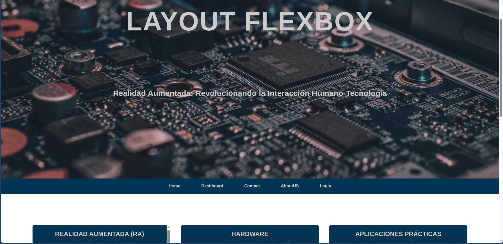

# Layout Básico con Flexbox

Este proyecto muestra un layout manual completo construido principalmente con Flexbox, **no es 100% responsivo**.

## Estructura Principal
El layout contiene las secciones típicas de una página web:
1. **Header**: Con imagen de fondo y texto centrado
2. **Nav**: Barra de navegación horizontal
3. **Main**: Contenedor de tarjetas de contenido
4. **Footer**: Pie de página simple

## Técnicas Flexbox Implementadas

### 1. Header centrado verticalmente
```css
.header {
    display: flex;
    min-height: 100vh;
}

.header__section {
    margin: auto; /* Centrado perfecto */
}
```

### 2. Barra de navegación flexible
```css
.nav__group {
    display: flex;
    flex-flow: row wrap;
    justify-content: center;
}
```

### 3. Tarjetas de contenido responsivas
```css
.main__container {
    display: flex;
    flex-flow: row wrap;
    justify-content: space-evenly;
}

.card {
    flex-grow: 1; /* Permite que las tarjetas crezcan */
    width: 400px; /* Ancho base */
}
```

## Limitaciones de Responsividad
Aunque usa Flexbox, el diseño tiene varias limitaciones responsivas
Es decir no es adaptable a todos los dispositiovos moviles y se recomienda solo como material de practica.
Este layout sirve como excelente base para seguir desarrollando habilidades en diseño web moderno